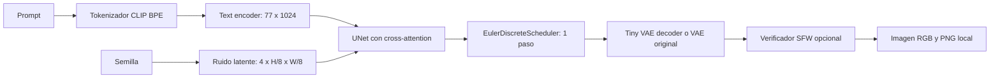

# Generación local de imágenes con SD-Turbo

[](https://www.python.org/)
[](https://pytorch.org/)
[](https://huggingface.co/docs/diffusers/)
[](https://www.gradio.app/)
[](LICENSE)
[](#modo-offline)

Aplicación de texto a imagen en **CPU, FP32 y sin CUDA**, con interfaz Gradio y CLI. La instalación y `download_model.py` requieren internet. Después de preparar los archivos, la carga y la generación usan exclusivamente `models/`, incluso con la caché global de Hugging Face vacía.

## Resultado


*Generado con SD-Turbo, 1 paso, 512x512, perfil SFW, CPU/FP32.*

## Instalación en frío

Usa **Python de 64 bits, versiones 3.10 a 3.12**. La combinación verificada en este proyecto es Python 3.12 en Windows. Ejecuta los comandos desde la carpeta del proyecto.

En CMD:

```cmd
python -m venv venv
venv\Scripts\activate
pip install torch torchvision --index-url https://download.pytorch.org/whl/cpu
pip install -r requirements.txt
python download_model.py
python generate.py --prompt "a test photo of a cat" --steps 1
```

En PowerShell, la activación es `venv\Scripts\Activate.ps1`. También puedes usar `venv\Scripts\python.exe` directamente sin activar el entorno. En Linux x86-64, activa con `source venv/bin/activate`; esta plataforma no se ha validado en este equipo. Estas versiones y ruedas CPU no cubren macOS/Apple Silicon ni Python 3.13 o superior.

`requirements.txt` fija también `torch==2.2.2+cpu` y `torchvision==0.17.2+cpu`: si el primer comando instala una versión diferente, el siguiente la sustituye por la pareja compatible. Para evitar esa descarga adicional, puedes instalar directamente:

```cmd
pip install torch==2.2.2+cpu torchvision==0.17.2+cpu --index-url https://download.pytorch.org/whl/cpu
pip install -r requirements.txt
```

Las dependencias de inferencia e interfaz se fijan en el archivo: Diffusers 0.27.2, Transformers 4.40.1, Hub 0.23.1, Gradio 4.36.1, FastAPI 0.112.2, Starlette 0.38.6 y Pydantic 2.10.6, entre otras. Starlette satisface `starlette<1.0.0` y el rango de FastAPI. `sentencepiece` no es necesario para el tokenizador CLIP y no se instala en este flujo. Las dependencias transitivas no constituyen un lock universal; usa `pip check` para detectar inconsistencias.

```cmd
python -m pip check
python -c "import torch; print(torch.__version__, torch.version.cuda)"
```

La segunda comprobación debe mostrar `2.2.2+cpu` y `None`.

## Preparación del modelo

`download_model.py` descarga revisiones concretas de tres recursos:

| Recurso | Carpeta local | Uso |
|---|---|---|
| `stabilityai/sd-turbo` | `models/sd-turbo/` | Tokenizador, text encoder, UNet, scheduler y VAE original |
| `madebyollin/taesd` | `models/taesd/` | Tiny VAE opcional, activado por defecto |
| `CompVis/stable-diffusion-safety-checker` | `models/safety-checker/` | Clasificador y preprocesador de imágenes para el perfil SFW |

Se descargan pesos FP32 y configuraciones, sin duplicar variantes FP16 ni el checkpoint monolítico. Los SHA de revisión están en `config.yaml`; la descarga usa `local_dir`, cuyos archivos son independientes de la caché global. La descarga del verificador SFW se hace también si normalmente usas NSFW, para que ambos perfiles estén preparados.

Al terminar, el script crea un proceso nuevo que verifica la carga con la configuración offline. Una descarga incompleta o una incompatibilidad de carga produce código de salida distinto de cero. Esta comprobación carga el modelo; la prueba de generación real es el comando CLI posterior.

```cmd
python download_model.py
python download_model.py --verify-only
python download_model.py --force
```

La primera orden permite reanudar la preparación; `--verify-only` no descarga y comprueba la carga; `--force` vuelve a descargar los archivos seleccionados. No combines `--force` con `--verify-only`. Si cambias `vae.enabled` a `false`, se utilizará el VAE original que ya se descargó.

`models/`, entornos virtuales y resultados están excluidos en `.gitignore`. No incluyas pesos de varios GB en el repositorio. Para trasladar la aplicación a otro equipo desconectado, copia código y `models/` completos y prepara sus dependencias para el mismo sistema operativo y versión de Python.

## Garantías y límites del modo offline

El código aplica estas medidas antes de importar las bibliotecas de generación:

- Fuerza `HF_HUB_OFFLINE=1`, `TRANSFORMERS_OFFLINE=1` y `HF_DATASETS_OFFLINE=1`.
- Deshabilita telemetría con `HF_HUB_DISABLE_TELEMETRY=1`, `DO_NOT_TRACK=1` y `GRADIO_ANALYTICS_ENABLED=False`.
- Resuelve aliases a rutas absolutas bajo `models/` y comprueba su existencia antes de llamar a los loaders.
- Pasa `local_files_only=True` a los loaders del pipeline, Tiny VAE, verificador, preprocesador, LoRA y embeddings.
- No ejecuta un fallback remoto si un archivo falta, está corrupto o es incompatible.
- Usa fuentes del sistema en Gradio, `analytics_enabled=False`, `share=False` y servidor en `127.0.0.1`.

La interfaz se comunica con un servidor HTTP en tu propio equipo; esa comunicación local es necesaria y no equivale a usar internet. No hay llamadas a la API de inferencia de Hugging Face. `download_model.py` es el único punto de preparación que habilita acceso al Hub.

La prueba `smoke_test.py` bloquea conexiones mediante un audit hook de Python y usa una caché temporal vacía. Las pruebas de Gradio permiten únicamente loopback, incluido el que usa internamente `asyncio` en Windows. Esto verifica las rutas soportadas con las versiones fijadas; no configura un firewall del sistema ni controla extensiones del navegador o programas ajenos.

## Interfaz web

```cmd
python app.py
```

Abre `http://127.0.0.1:7860` en el navegador. Introduce un prompt y pulsa **Generar imagen**; también puedes enviar el prompt con Enter. El navegador no se abre automáticamente. Detén el proceso con Ctrl+C.

El perfil `sfw` carga el verificador visual local; `nsfw` no lo carga. Ambos conservan las heurísticas de prompts de `src/guardrails.py`. Estas heurísticas tienen falsos positivos y falsos negativos y no garantizan que una imagen sea segura. Si el verificador marca una salida NSFW, se muestra el motivo y no se guarda la imagen filtrada.

Gradio muestra imagen, semilla efectiva, tiempo, RSS al finalizar y ruta del PNG. La galería contiene los últimos 16 PNG del perfil. Los errores de configuración, carga, adaptadores, inferencia o escritura aparecen con su tipo y mensaje en la interfaz; la consola registra el traceback con `logger.exception`.

El pipeline se carga de forma diferida en la primera generación y se conserva en memoria. La caché se invalida al cambiar modelo, perfil de seguridad, LoRA o configuración de memoria. Un fallo al recargar deja la caché vacía para permitir reintentar. Ambos eventos comparten una cola de concurrencia 1 y un lock protege el pipeline compartido, porque el scheduler y los adaptadores tienen estado mutable.

## Línea de comandos

Generación por defecto, 512 x 512, un paso y perfil SFW:

```cmd
python generate.py --prompt "a test photo of a cat" --steps 1
```

Semilla fija, tamaño menor y cuatro hilos:

```cmd
python generate.py --prompt "a lighthouse on a rocky coast" --seed 0 --width 256 --height 256 --threads 4
```

Tres imágenes secuenciales con semillas 42, 43 y 44:

```cmd
python generate.py --prompt "a red bicycle in a garden" --batch 3 --seed 42 --output output/examples
```

Usar el perfil NSFW con un prompt neutro:

```cmd
python generate.py --prompt "an abstract watercolor landscape" --profile nsfw
```

Adaptadores preparados previamente, compatibles con SD 2.1/SD-Turbo:

```cmd
python generate.py --prompt "a landscape in my style" --lora models/adapters/style.safetensors --lora-scale 0.7
python generate.py --prompt "a landscape with <my-token>" --embedding models/embeddings/my-token.safetensors
```

El script de descarga no obtiene adaptadores personales. Copia previamente los archivos en `models/`. Se admiten archivos `.safetensors`, no IDs remotos, y los errores de incompatibilidad se propagan. La LoRA usa PEFT y no se fusiona permanentemente con los pesos base. Los ejemplos de adaptadores requieren que existan esos archivos; no se distribuyen con el proyecto.

| Opción CLI | Valor por defecto / comportamiento |
|---|---|
| `--prompt`, `-p` | Obligatorio, no vacío |
| `--negative-prompt`, `-n` | Perfil; sin efecto con CFG <= 1 |
| `--model`, `-m` | Modelo del perfil; admite alias, repo configurado como alias o su ruta local |
| `--profile` | `sfw`; alternativa `nsfw` |
| `--safety-checker` | Según perfil; `on` u `off` lo sobrescribe |
| `--steps`, `-s` | `models.sd_turbo.steps`, inicialmente 1; entero 1-50 |
| `--cfg` | `models.sd_turbo.guidance_scale`, inicialmente 0.0; SD-Turbo exige 0 |
| `--width`, `-W`; `--height`, `-H` | Configuración, inicialmente 512; múltiplos de 8 entre 64 y 1024 |
| `--seed` | Aleatoria si se omite; entero entre 0 y 2^63-1 |
| `--batch`, `-b` | 1; entero positivo; procesa y guarda una imagen a la vez |
| `--output`, `-o` | Carpeta del perfil |
| `--threads` | `hardware.num_threads` |
| `--backend` | `auto` y `diffusers_cpu` ejecutan exclusivamente Diffusers CPU |
| `--lora`; `--lora-scale` | Sin adaptador; escala 1.0, rango 0-2 |
| `--embedding` | Sin embedding adicional |
| `--verbose`, `-v` | Activa logs de depuración |

Las rutas relativas de modelos y salidas se resuelven desde el proyecto, aunque ejecutes el script desde otra carpeta. Cada PNG incluye prompt, negative prompt solicitado, modelo, semilla real, fecha, identificador de generación por IA y métricas JSON. La semilla `0` es válida. Se usan microsegundos en el nombre para evitar colisiones habituales. La reproducibilidad depende también de pesos, parámetros, versiones y hardware.

## Configuración

| Clave en `config.yaml` | Efecto |
|---|---|
| `models.<alias>.repo` / `revision` | Origen y commit exacto para preparación; el repo nunca se pasa como destino remoto en inferencia |
| `models.<alias>.path` | Directorio Diffusers local bajo `models/` |
| `models.<alias>.steps` / `guidance_scale` | Valores predeterminados de la CLI y del modelo inicial de la interfaz |
| `vae.enabled` / `path` | Usa Tiny VAE local o el VAE original del pipeline |
| `vae.repo` / `revision` | Descarga inicial del Tiny VAE |
| `vae.tiling` | Activa tiling sobre el VAE que realmente se usará |
| `safety_checker.repo` / `revision` / `path` | Recurso del verificador visual local |
| `profiles.<perfil>.model` | Alias de modelo del perfil |
| `profiles.<perfil>.safety_checker` | Carga o no el verificador visual |
| `profiles.<perfil>.negative_prompt` | Valor predeterminado; SD-Turbo no lo utiliza con CFG=0 |
| `profiles.<perfil>.output_dir` | Carpeta de imágenes del perfil |
| `hardware.num_threads` | Hilos intra-op de Torch, OpenMP/MKL/OpenBLAS; inter-op se configura una sola vez |
| `hardware.attention_slicing` | Alternativa a la atención SDPA predeterminada para comparar memoria y tiempo |
| `generation.width` / `height` | Tamaño inicial de CLI y Gradio |
| `web.port` | Puerto de loopback, inicialmente 7860 |

Reinicia Gradio tras modificar sus controles iniciales o el puerto. La ruta soportada y verificada es SD-Turbo; agregar otros modelos requiere comprobar compatibilidad de componentes y adaptadores. Los parámetros antiguos de DirectML, presupuesto de VRAM y `max_rss_mb` se retiraron porque no controlaban la ejecución real ni imponían límites de memoria.

## Arquitectura técnica

SD-Turbo es una versión destilada de **Stable Diffusion 2.1**. El entrenamiento mediante Adversarial Diffusion Distillation combina señales de un modelo docente y una pérdida adversarial para permitir síntesis con pocas evaluaciones. El modelo publicado permite 1-4 pasos; un paso es la configuración inicial. Que use un paso no implica que tarde un segundo en CPU. [Tarjeta oficial de SD-Turbo](https://huggingface.co/stabilityai/sd-turbo).



El tokenizador convierte texto a IDs BPE. El text encoder produce el condicionamiento textual; el archivo descargado declara 77 posiciones y dimensión oculta 1024. La UNet recibe ese condicionamiento mediante cross-attention y predice ruido sobre cuatro canales latentes. Su configuración tiene cuatro bloques descendentes y cuatro ascendentes. Para 512 x 512, el espacio latente es 4 x 64 x 64; el scheduler Euler conserva la configuración publicada, incluida `timestep_spacing: trailing`. Estas dimensiones se obtienen de los JSON locales de la revisión fijada, no de una arquitectura SD 1.5.

En texto a imagen no se codifica una fotografía de entrada: se parte de ruido aleatorio. Después del paso de difusión, el decoder del VAE transforma el latente en RGB. No se calculan gradientes, gracias a `torch.inference_mode()`. Todo reside en CPU con `torch.float32`.

SD-Turbo se usa con `guidance_scale=0.0`. Así se evita la evaluación incondicional adicional de classifier-free guidance; `negative_prompt` no interviene. El proyecto rechaza CFG distinto de cero para este modelo y conserva el parámetro para otras configuraciones compatibles. [Uso oficial con Diffusers](https://huggingface.co/stabilityai/sd-turbo#diffusers).

`AutoencoderTiny` reemplaza el VAE original antes de cargar el pipeline, evitando mantener ambos en RAM durante la sustitución. TAESD tiene aproximadamente 2.45 millones de parámetros y unos 10 MB de pesos FP32. Reduce el coste del decoder, pero no reduce los pesos de la UNet ni del text encoder. Es una aproximación con posibles diferencias de detalle y color; TAESDXL es otro recurso para un espacio latente diferente. [TAESD](https://huggingface.co/madebyollin/taesd), [AutoencoderTiny en Diffusers](https://huggingface.co/docs/diffusers/v0.27.2/en/api/models/autoencoder_tiny).

El tiling se activa después de seleccionar el VAE definitivo. Attention slicing queda desactivado por defecto para conservar SDPA de PyTorch; activarlo puede reducir ciertos consumos, pero también aumentar bastante la latencia. No se usa CPU offload, que no aporta un destino GPU en esta aplicación. La carga de directorios locales sigue el mecanismo de [pipelines locales de Diffusers](https://huggingface.co/docs/diffusers/v0.27.2/en/using-diffusers/loading#local-pipeline).

El truncamiento de texto lo realiza el tokenizador real de Diffusers y su advertencia aparece en consola. Se eliminó la estimación por número de palabras, porque palabras y tokens no son equivalentes.

## Requisitos de sistema y rendimiento

- CPU x86-64 compatible con las ruedas de PyTorch. Se recomiendan varios núcleos y AVX2; el valor inicial es cuatro hilos y conviene medir en tu equipo.
- **16 GB de RAM recomendados**, con memoria virtual disponible. El perfil SFW agrega los pesos del verificador. Un equipo de 8 GB puede quedar corto según procesos abiertos, resolución y VAE; no se establece una garantía de funcionamiento en ese límite.
- Reserva **15-20 GB libres** para entorno, pesos, archivos temporales y resultados. Los pesos preparados ocupan varios GB; descargas repetidas y cachés separadas pueden duplicar espacio.
- Internet únicamente para instalación y preparación; CPU sin CUDA para la ejecución.

Empieza con 512 x 512 y un paso. Para reducir activaciones y tiempo, prueba 256 x 256, sabiendo que puede empeorar la composición. Reducir resolución no elimina los varios GB de pesos residentes. Más pasos o hilos no garantizan mayor calidad o velocidad.

Los logs informan **RSS actual/final en MiB**, no un pico de RAM. `seconds_per_step` divide el tiempo total de generación entre pasos e incluye tokenización, VAE y verificador; no es un perfil aislado de la UNet. La carga se registra por separado. Las cifras anteriores de rendimiento supuestamente medido se retiraron porque no había evidencia que las respaldara.

```cmd
python benchmark.py --quick
python benchmark.py --model sd_turbo
```

El benchmark usa el modelo local sin verificador visual, una imagen de calentamiento y tres repeticiones. Escribe JSON con muestras y Markdown en `benchmark_results/`. No incluye el tiempo de carga en la media de generación y devuelve error si alguna configuración falla.

## Validación

```cmd
python -m pip check
python -m unittest -v test_offline
python download_model.py --verify-only
python smoke_test.py
```

`test_offline.py` prueba rutas inexistentes, argumentos offline de loaders, semilla 0, validaciones, errores de Gradio, caché, adaptadores y esquema HTTP de la interfaz. Usa mocks para no necesitar pesos. `smoke_test.py` sí genera una imagen real de 256 x 256, con el verificador SFW, caché vacía y conexiones bloqueadas; guarda `output/smoke_test_256x256.png` y devuelve error si algo falla. El informe de revisión y resultados concretos está en [REVIEW.md](REVIEW.md).

## Solución de problemas

### No existe el modelo o falta un componente

Ejecuta `python download_model.py` con internet. No basta con tener pesos en `~/.cache/huggingface`: se necesita la estructura completa de `models/`. Después usa `python download_model.py --verify-only`. Para reparar corrupción, usa `--force`. No cambies `local_files_only=True` para esconder el error.

### Pydantic, Starlette o el esquema de Gradio

Errores como `TypeError: argument of type 'bool' is not iterable`, fallos de JSON Schema, errores de FastAPI o una página que no termina de cargar pueden deberse a mezclar versiones. Reinstala `requirements.txt` en un entorno nuevo y ejecuta `pip check` y `python -m unittest -v test_offline`. Fijar solo Gradio y dejar FastAPI/Pydantic completamente libres no preserva la combinación probada.

### DLL de PyTorch o NumPy incompatible

Confirma que usas el Python del entorno, de 64 bits, y las versiones CPU fijadas. NumPy se fija en 1.26.4 para el stack seleccionado. En esta revisión la versión más reciente de Torch instalada por el comando sin pins produjo `WinError 1114` al cargar `c10.dll`; la pareja 2.2.2/0.17.2 cargó correctamente. No instales CUDA para resolver este proyecto CPU.

### Caracteres extraños en Windows

Los archivos del proyecto son UTF-8 y no contienen emojis en código ni textos estáticos de la interfaz. El formatter también elimina emojis de los mensajes de logging. Si la terminal muestra acentos incorrectamente, en CMD:

```cmd
chcp 65001
set PYTHONUTF8=1
python app.py
```

En PowerShell puedes ejecutar `$env:PYTHONUTF8='1'` antes de iniciar Python. Los streams usan `errors='backslashreplace'` para que un carácter no representable no oculte la excepción original. Esto es distinto de cambiar la codificación del archivo o arreglar un traceback de Gradio.

### Error HTTPS durante la preparación

La instalación y descarga necesitan acceso a PyPI, al índice CPU de PyTorch y a los servidores de Hugging Face. Si una red usa certificados corporativos, instala su CA mediante el procedimiento de tu organización. En pip 24/Python 3.12, `--use-feature=truststore` permite usar el almacén del sistema. El script de descarga ya usa automáticamente el almacén de Windows mediante `truststore`; también puedes establecer `REQUESTS_CA_BUNDLE` a un PEM de confianza. No desactives la verificación TLS. Esto solo afecta la fase online. [Documentación de Truststore](https://truststore.readthedocs.io/en/latest/).

### Memoria insuficiente o inferencia lenta

Cierra procesos que consuman RAM, reduce resolución, mantén Tiny VAE y usa lotes secuenciales. Prueba `--threads 2` y `--threads 4` y compara tiempos. `hardware.attention_slicing: true` es otra opción a medir. No existe un límite duro de memoria configurado en YAML. Las primeras cargas incluyen lectura de disco y pueden paginar; no se promete una duración fija.

### Error al generar o salida marcada NSFW

Revisa el tipo y mensaje en el panel y el traceback de consola. El verificador local puede producir falsos positivos. Si falta o está dañado, el perfil SFW falla explícitamente: no se desactiva de manera silenciosa. Los dos perfiles conservan las heurísticas de prompts.

### Advertencias de metadatos o caché de bibliotecas

La revisión fijada de TAESD contiene `shift_factor=0.0` y `upsample_fn=nearest`, campos que Diffusers 0.27.2 no reconoce y avisa que ignora. La carga y las generaciones de prueba pasaron con esa combinación. Transformers también puede emitir una advertencia genérica de migración al encontrar una caché vacía: los directorios locales no necesitan esa caché. No habilites internet en inferencia para ocultar esas advertencias; usa el resultado de `--verify-only` y `smoke_test.py` para distinguir un aviso de un fallo real.

### Puerto ocupado

Detén la instancia anterior o cambia `web.port` y reinicia `app.py`. La dirección sigue siendo `127.0.0.1`; no se crea un enlace público.

## Estructura y alcance

```text
app.py                 Interfaz Gradio y cache del pipeline
generate.py            CLI y escritura de PNG con metadatos
download_model.py      Preparacion online y verificacion de carga
config.yaml            Rutas, revisiones, perfiles y parametros
requirements.txt       Stack CPU e interfaz
requirements-onnx.txt  Dependencias experimentales de exportacion
smoke_test.py          Inferencia real sin conexiones
test_offline.py        Regresiones sin pesos
benchmark.py           Medicion local con warmup
src/config.py          Configuracion y resolucion de rutas
src/runtime.py         Variables offline y logs sin emojis
src/pipeline.py        Carga local, adaptadores y generacion CPU
src/guardrails.py      Heuristicas locales de prompts
src/convert.py         Utilidades ONNX opcionales
models/                Recursos descargados, ignorados por Git
output/                PNG y archivos de validacion, ignorados por Git
```

ONNX y DirectML no son backends de generación de esta versión. `src/convert.py` conserva utilidades experimentales de exportación ONNX y cuantización MatMul, con dependencias separadas. No se incluyen en el arranque en frío y no se han validado con una exportación completa de varios GB. Una exportación fallida ya no se presenta como éxito parcial. La conversión antigua de un checkpoint monolítico se rechaza explícitamente: cargaba un modelo remoto de referencia y trataba el pipeline como si tuviera `load_state_dict`, sin convertir realmente sus componentes.

Consulta la [tarjeta del modelo del proyecto](MODEL_CARD.md) para limitaciones. Las condiciones de uso de los pesos pertenecen a sus autores; `download_model.py` conserva los archivos de licencia disponibles. La documentación de instalación del proyecto es este README, no los ejemplos CUDA que puedan aparecer dentro de las tarjetas originales descargadas.
